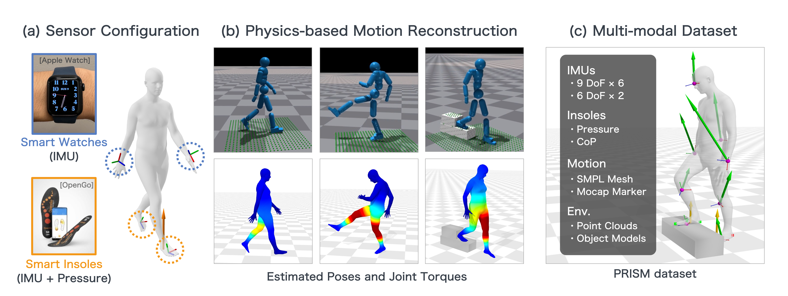

# Ground Reaction Inertial Poser (GRIP)

[](https://ryosukehori.github.io/grip-project/)
[](https://github.com/RyosukeHori/PRISM)

Official implementation of **Ground Reaction Inertial Poser (GRIP)** — physics-based human motion capture from sparse IMUs and insole pressure sensors.



## 📋 Overview

GRIP is a two-stage pipeline:

1. **KinematicsNet** — Predicts kinematic joint positions / rotations / velocities from IMU + insole signals.
2. **DynamicsNet** — Refines the KinematicsNet output into physically plausible motion via RL in Isaac Gym.

```
IMU + Insole ──▶ KinematicsNet ──▶ DynamicsNet ──▶ Refined Motion
```

aitviewer-based visualization tools are provided to inspect every stage.

## 🗂️ Repository Layout

```
dynamics_net/        # DynamicsNet (Hydra + Isaac Gym + rl_games)
kinematics_net/      # KinematicsNet (PyTorch + articulate)
data_process/        # PRISM capture -> KinematicsNet dataset -> DynamicsNet dataset
visualization/       # aitviewer-based visualization
evaluation/          # GRIP metrics (MPJPE / MPJRE / Foot Slide / FP / GRF Error / ...)
third_party/poselib/ # NVIDIA Isaac Gym Envs poselib (vendored)
scripts/             # shell entry points (run from project root)
data/                # SMPL body model + PRISM dataset (prepare in advance)
```

## ⚙️ Setup

Tested with Python 3.8, PyTorch 2.1.1, CUDA 12.1.

```bash
# 1. Conda environment
conda env create -f environment.yml --solver=libmamba
conda activate grip

# 2. Isaac Gym (DynamicsNet only — skip if you just want KinematicsNet)
#    Download Preview 4 from https://developer.nvidia.com/isaac-gym
cd /path/to/isaacgym/python && pip install -e .

# 3. Python deps (handles install order + chumpy patch automatically)
cd /path/to/GRIP && bash scripts/setup_grip.sh
```

📁 **Place the data** in this layout before running anything:

| Path | Contents | Source |
|---|---|---|
| `data/smpl/SMPL_{NEUTRAL,MALE,FEMALE}.pkl` | SMPL body model | [SMPL](https://smpl.is.tue.mpg.de/) |
| `data/preprocessed/{kinematics_net,dynamics_net}/...` | Preprocessed train / test data (~4.5 GB zipped) | [download](https://docs.google.com/forms/d/e/1FAIpQLSeU9QCWYGtJDlHWlrej72ihuABk3OCHQL7sSEGXIvPnZN3nzA/viewform?usp=dialog) |

Drop the zip into the project root and unpack it under `data/`:

```bash
unzip prism_preprocessed.zip -d data/
```

> The PRISM link above provides the **preprocessed tensors** needed to reproduce GRIP without re-running the data pipeline. If you want the **raw PRISM dataset** (mocap, IMU, insole, …), grab it from the [PRISM repository](https://github.com/RyosukeHori/PRISM) and run `data_process/kinematics_dataset.py` + `data_process/dynamics_dataset.py` yourself.

✅ **Verify the install:**

```bash
python dynamics_net/run_hydra.py --help
```

<details>
<summary>📝 Notes </summary>

- `--solver=libmamba` is required — the classic conda solver hangs on the 4-channel mix.
- `scripts/setup_grip.sh` installs PyTorch 2.1.1 with the **CUDA 12.1 wheel** via pip; this matches the reference numerical kernels. Installing PyTorch with `pytorch-cuda=11.8` from conda on a CUDA 12.x driver causes motion_lib's frame-count to overflow to `INT_MAX` and inflates fall counts — do not skip the pip install step.
- The same script force-reinstalls numpy from the pip wheel (OpenBLAS). conda-forge ships a numpy linked against netlib reference BLAS which has different floating-point ordering and produces visibly different evaluation numbers. If you ever see motion_lib reporting `Max frames: 2147483647`, check `numpy.show_config()` — it must show OpenBLAS, not `cblas/blas`.
- `scripts/setup_grip.sh` installs the custom `smplx` / `smpl_sim` forks **before** `requirements.txt` (otherwise pip's resolver gets stuck on `hydra-core` / `gymnasium`), then patches `chumpy` 0.70 for numpy ≥ 1.24 compatibility.
- Headless rendering on Linux: `sudo apt install xvfb` (used by `pyvirtualdisplay`).
- Isaac Gym sometimes can't find `libpython3.8.so.1.0`; fix with `export LD_LIBRARY_PATH=$CONDA_PREFIX/lib:$LD_LIBRARY_PATH` in `~/.bashrc`.

</details>

## 🚀 Usage

Run every shell script **from the project root**.

### KinematicsNet

```bash
python data_process/kinematics_dataset.py  # build dataset from raw PRISM capture
bash scripts/kinematics_train.sh           # train (independent, then joint)
bash scripts/kinematics_inference.sh       # inference
```

### DynamicsNet

```bash
python data_process/dynamics_dataset.py   # build dataset from KinematicsNet output
bash scripts/dynamics_train.sh            # train
bash scripts/dynamics_test.sh             # test
```

### Evaluation

```bash
bash scripts/evaluate.sh                  # MPJPE / MPJRE / Foot Slide / FP / GRF Error / ...
```

### Visualization

```bash
python visualization/vis_kinematics_dataset.py  # KinematicsNet input dataset
python visualization/vis_kinematics_output.py   # KinematicsNet inference output
python visualization/vis_dynamics_dataset.py    # DynamicsNet input dataset
python visualization/vis_dynamics_output.py     # DynamicsNet output
```

### Output Layout

```
output/
├── kinematics_net/    # train: models/best_model.pt   |  inference: infer/<seq>.npz
├── dynamics_net/      # train: Humanoid.pth           |  test: results_{success,failed}/<chunk>.npz
└── evaluation/        # gt.pkl, grip.pkl, integrated.pkl, evaluation_results.xlsx
```


## Acknowledgements

- [NVIDIA Isaac Gym](https://developer.nvidia.com/isaac-gym) — physics simulation
- [poselib](third_party/poselib/) — vendored from NVIDIA Isaac Gym Envs (see [third_party/poselib/README.md](third_party/poselib/README.md))
- [rl_games](https://github.com/Denys88/rl_games) — RL backend
- [PHC](https://github.com/ZhengyiLuo/PHC) — humanoid imitation policy reference
- [SimXR](https://github.com/ZhengyiLuo/SimXR) — sparse-sensor humanoid control reference
- [GlobalPose](https://github.com/Xinyu-Yi/GlobalPose) — IMU-based global pose baseline
- [aitviewer](https://github.com/eth-ait/aitviewer) — visualization
- [SMPL](https://smpl.is.tue.mpg.de/) — body model
